# Network Automation Lab

Lab built on real hardware: UserGate NGFW + Cisco Catalyst 2960.

## Architecture

- **UserGate NGFW**: WAN `10.1.10.50/24`, LAN `10.100.20.1/24`, DHCP, NAT, firewall
- **Catalyst 2960**: L2 switch, VLAN 1, SSH `10.100.20.10`
- **Ansible**: control node on macOS
## Topology

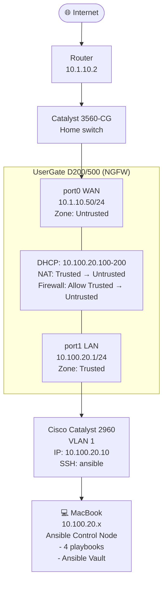
## UserGate NGFW Configuration

### Interfaces and Zones

- **port0 (WAN)**: `10.1.10.50/24`, zone `Untrusted`
- **port1 (LAN)**: `10.100.20.1/24`, zone `Trusted`

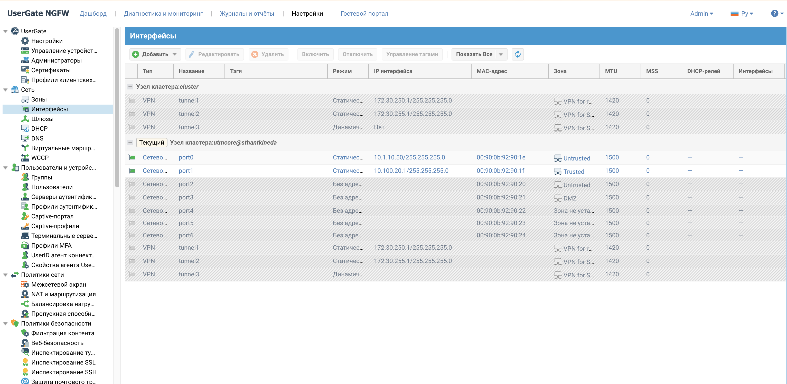

### Default Gateway

Gateway `ISP-H` (`10.1.10.2`) configured as default route.

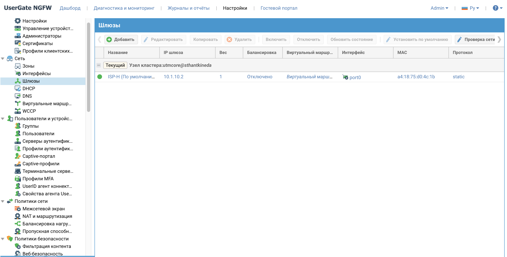

### DHCP for Lab

DHCP subnet `HQ-TRUSTED` provides addresses `10.100.20.100-200`.

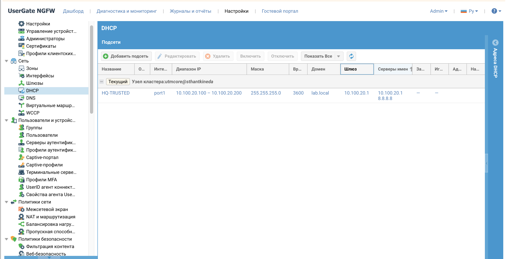

### NAT (SNAT)

Rule `SNAT-HQ-TO-INTERNET` translates addresses from `Trusted` to `Untrusted`.

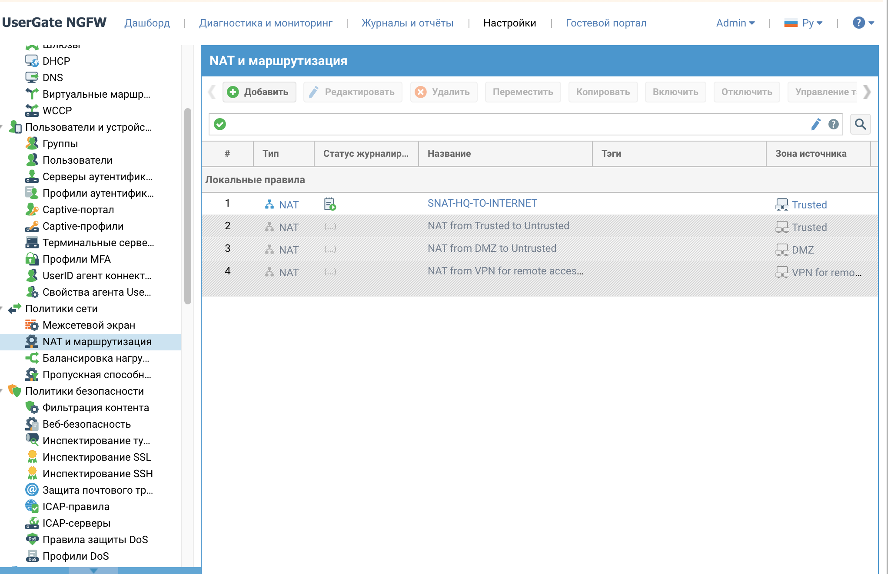

### Firewall Policy

Rule `Allow trusted to untrusted` permits traffic from lab to internet.

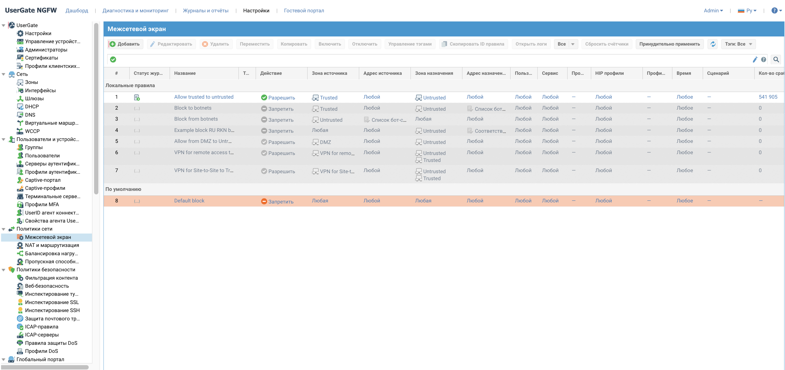

### Network Status Verification (CLI)

Verification of interfaces, routes, and connectivity:

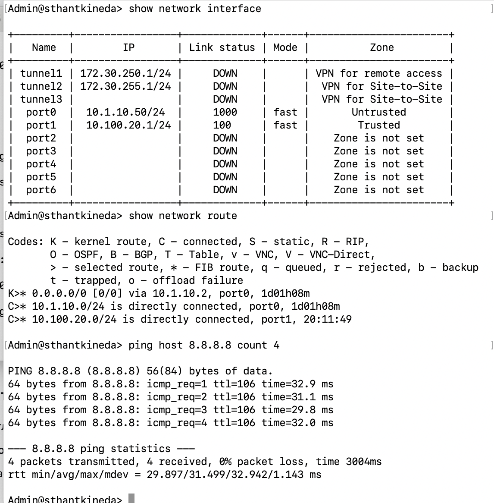

### Dashboard

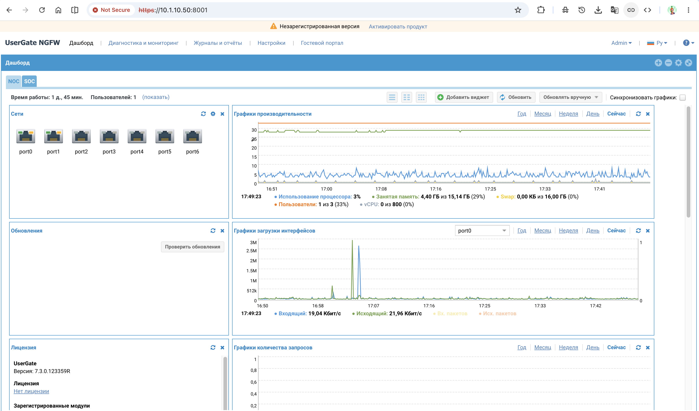

## Tech Stack

- Ansible 2.21.4
- `cisco.ios` collection
- Python 3.13 (venv)
- `paramiko 3.5.1` (for legacy SSH)

## Playbooks

| Playbook | Description |
|---|---|
| `gather_facts.yml` | Collect device info from Catalyst 2960 |
| `backup_config.yml` | Save running-config with timestamp |
| `configure_vlan.yml` | Create VLANs 100 and 200 |
| `configure_port_security.yml` | Configure port-security on access ports |

## Results

| Playbook | Status |
|---|---|
| `gather_facts.yml` | ✅ Collected device info (IOS 12.2(50)SE5) |
| `backup_config.yml` | ✅ Saved running-config with timestamp |
| `configure_vlan.yml` | ✅ Created VLAN 100 (LAB-USERS) and VLAN 200 (LAB-SERVERS) |
| `configure_port_security.yml` | ✅ Configured port-security on Fa0/3 (Restrict, max 2 MAC) |

## Legacy SSH Support

For old Cisco IOS (12.2), we use `paramiko 3.5.1` with explicit KEX algorithms in `~/.ssh/config`. This is more reliable than `ansible_legacy_ssh=true`.

## Compatibility Notes

- **IOS 12.2(50)SE5** on Catalyst 2960 — legacy version
- `cisco.ios.ios_vlans` not supported (requires IOS 12.3+)
- `cisco.ios.ios_config` works but reports `changed=1` on each run 
  (idempotency limited by legacy IOS)
- This is a common trade-off when automating legacy network devices

## Security Practices

- Passwords stored in encrypted Ansible Vault (`group_vars/switches/vault.yml`)
- Backups excluded from Git via `.gitignore` (industry best practice)
- No secrets in plaintext anywhere in the repository

## How to Run

```bash
source ~/ansible-venv/bin/activate
ansible-playbook -i inventory.ini playbooks/gather_facts.yml --ask-vault-pass
```

## Screenshots

### VLANs on Catalyst 2960

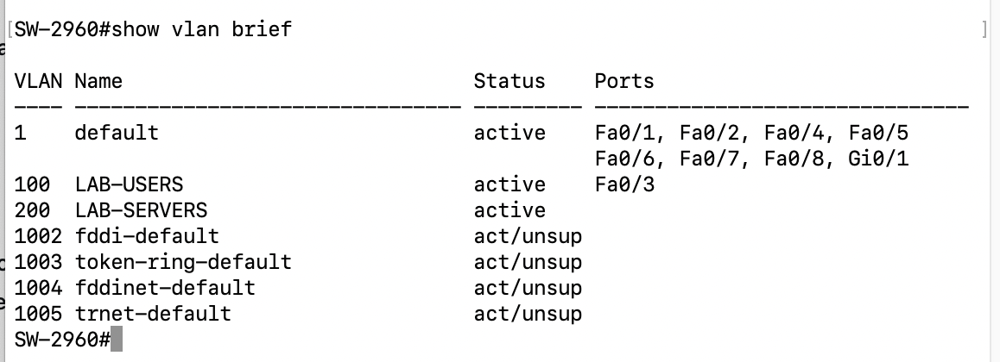

*VLAN 100 (LAB-USERS) and VLAN 200 (LAB-SERVERS) created via Ansible.*

### Port Security on FastEthernet0/3

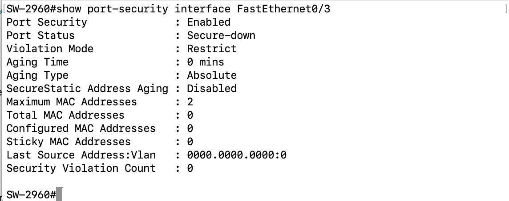

*Port-security configured via Ansible: Restrict mode, max 2 MAC addresses.*

### Interface Status

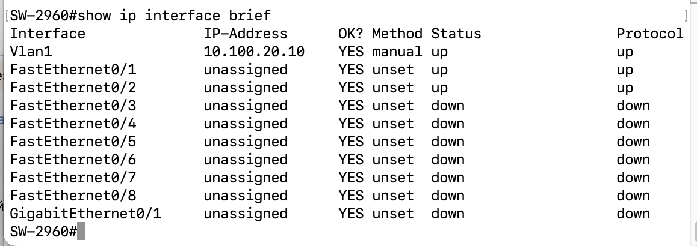

*Vlan1 up/up with management IP `10.100.20.10`. Fa0/1 and Fa0/2 connected.*

### Device Version

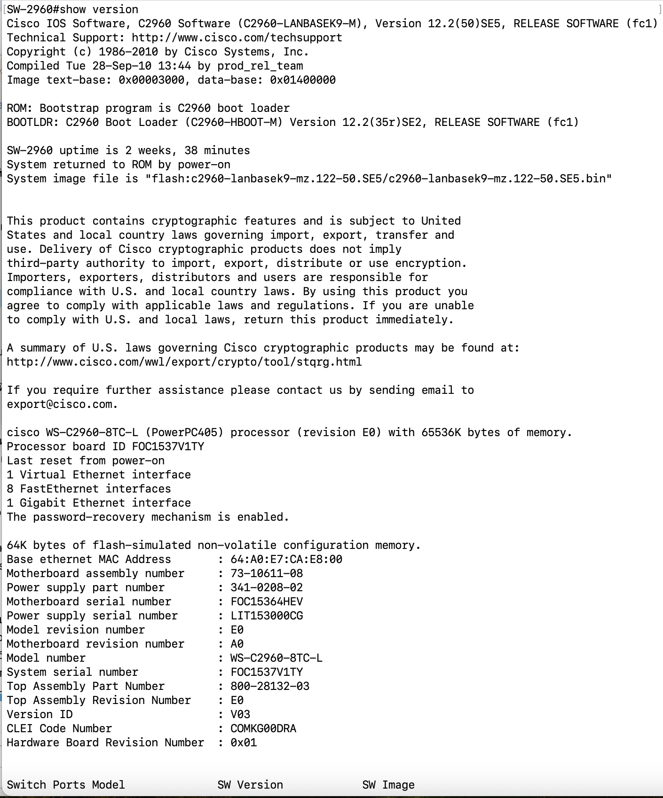

*Cisco IOS 12.2(50)SE5 on WS-C2960-8TC-L.*

### Running Configuration

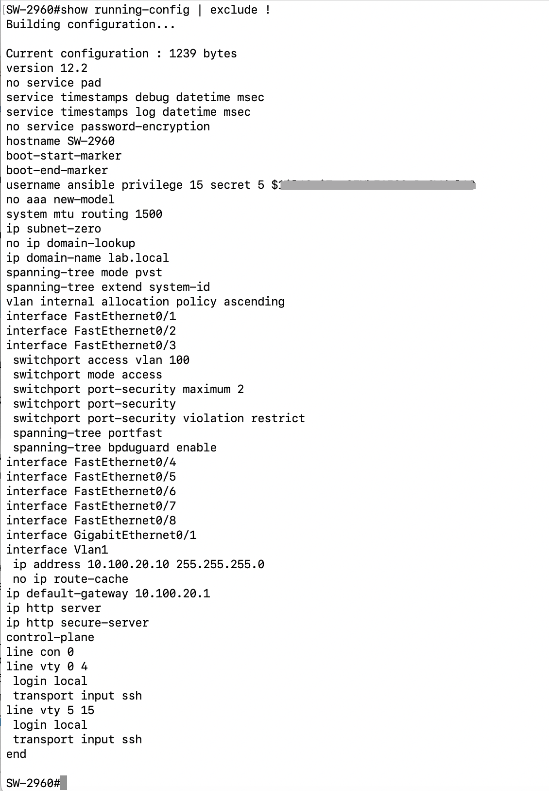

*Full running-config with port-security and VLANs (password hash masked).*

### Ansible Playbook Results

#### Gather Facts

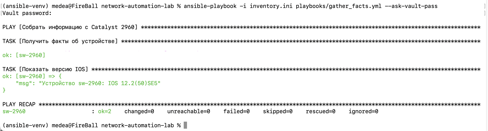

*Device info collected — IOS 12.2(50)SE5.*

#### Configure Port Security (idempotent)

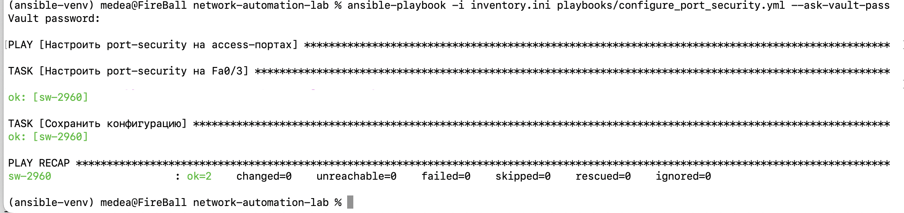

*Repeated run shows `changed=0` — playbook is idempotent.*

## Documentation

- [IP Plan](docs/ip-plan.md) — Network addressing scheme (home + lab)